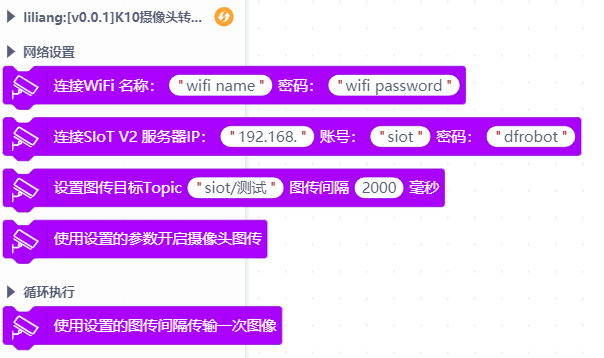

# 行空板K10摄像头图传可视化面板

# 说明
将UNIHIKER K10摄像头画面实时转换成base64编码，然后上传到SIoT V2，最终在Mind+数据可视化面板中的网络图片组件上显示画面。

> 仅适用于行空板K10&SIoT V2&Mind+数据可视化面板。

# 积木

# 使用方法

## SIoT V2服务器
- 首先在某个设备上（需要与后续K10连接同一个WiFi）运行一个SIoT V2服务器
- 找到IP地址。
- SIoT V2链接：[https://mindplus.dfrobot.com.cn/dashboard](https://mindplus.dfrobot.com.cn/dashboard)

## K10上运行程序
- 程序中WiFi为与运行SIoT V2服务器的设备同样的WiFi  
- 程序中MQTT服务器的IP地址为运行SIoT V2服务器的IP地址  
- 上传程序，打开串口，9600波特率可以看到调试信息。  
> 注意：此功能对内存消耗过大，开启此功能时不保证其他功能还能正常使用，推荐在一个单独的K10板子上运行此图传功能，其他功能在另外的板子上实现。  

 

## 可视化面板查看图片
- 运行可视化面板的电脑需要与前面的SIoT V2服务器和K10设备在同一个WiFi下
- 设置SIoT V2服务器地址，连接成功
- 拖出来一个“网络图片”组件，选择Topic与前面K10程序中设置的Topic一致
- 即可看到实时摄像头画面。有延迟为正常，数据量较大处理速度慢。

# 支持列表

|主板型号|实时模式|ArduinoC|MicroarduinoC|arduinoC|备注|
|-----|-----|:-----:|-----|-----|-----|
|uno||||||
|micro:bit||||||
|marduinoC||||||
|arduinonano||||||
|leonardo||||||
|mega2560||||||
|unihiker K10||√||||

# 参考资料

[https://github.com/DFRobot/k10_base64](https://github.com/DFRobot/k10_base64)

# 更新日志

- V0.0.1 功能完成
